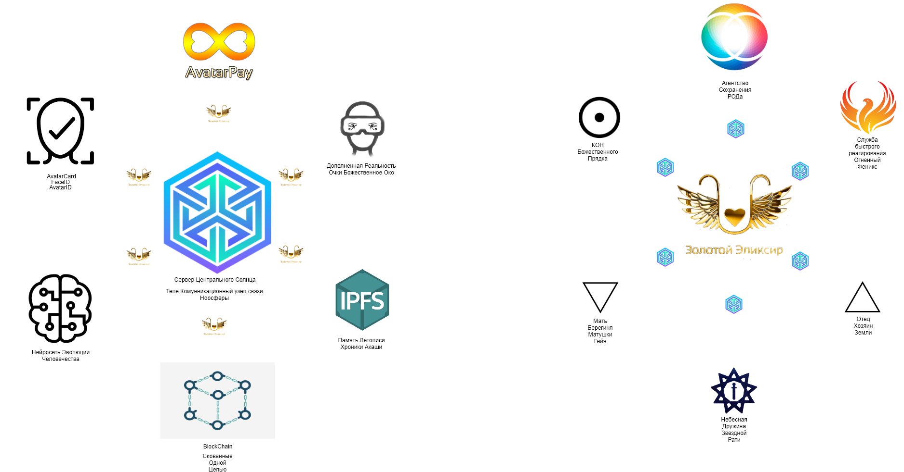
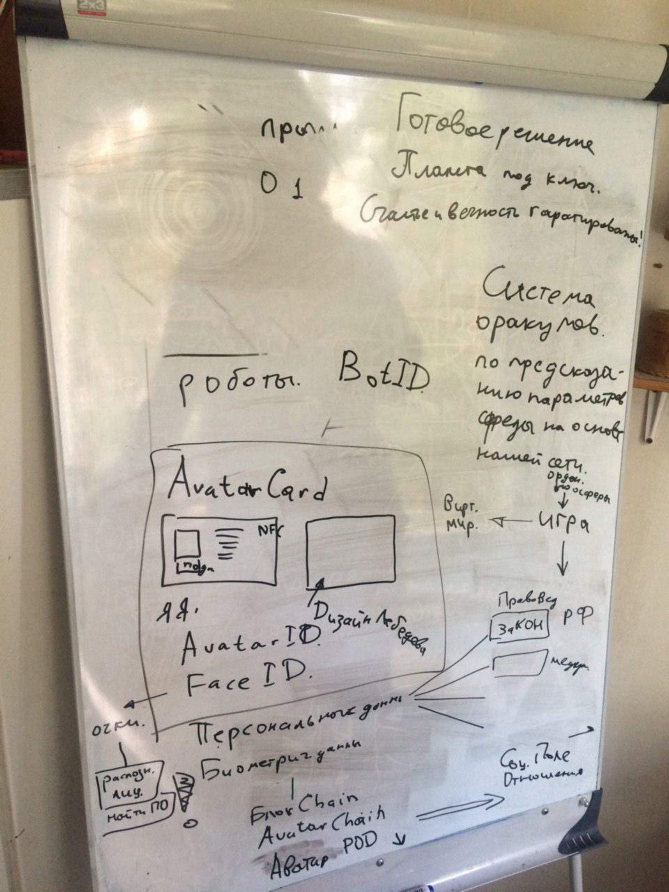

# Проект ЯАватар (версия 0.0.1)

## Предисловие

У человечества есть только один путь спасения — осознание своей божественности. Вы — семена этого понимания. Всё, что вы осмысливаете, все, что вы осознаёте, поднимает и расширяет сознание повсюду. А когда вы живёте тем, что вы поняли, и только ради блага своей целеустремлённой жизни, вы позволяете другим увидеть в вас более масштабный мыслительный процесс, более глубокое понимание и существование, более целенаправленное, чем то, какое они видят вокруг себя. 

Много лет назад я жил на этом плане, называемом Землей или Террой. В той жизни я не умер: я вознёсся, потому что научился использовать силу своего мышления и уносить своё тело с собой в невидимое измерение жизни. 

Совершив это, я осознал существование безграничной свободы, безграничной радости, безграничной жизни. Среди тех, кто жил здесь после меня, нашлись другие, которые тоже вознеслись. 

Теперь я — часть невидимого братства, которое глубоко любит человечество. Мы — ваши братья; мы слышим ваши молитвы, ваши медитации и наблюдаем ваши движения туда и сюда. Мы — это те, кто жил здесь как человек и испытал отчаяние, горе и радость, которые вам всем известны. Но мы познали, как преодолеть ограничения человеческого опыта и выйти за его пределы, чтобы осознать более возвышенное состояние бытия. 

Я пришёл сказать вам, что вы для нас очень ценны и важны, потому что жизнь, которая протекает через вас, и мысли, которые посещают каждого из вас — как бы вы их ни расценивали, — есть разум и жизненная сила, которую вы называете Богом. Это та сущность, которая соединяет всех нас не только с теми, кто живет на вашем плане, но и с теми, кто находится в неизвестных вселенных, которые можно увидеть только теми глазами, каких у вас ещё нет. 

Я здесь, чтобы напомнить вам о наследии, о котором большинство из вас давным-давно позабыли. Я пришёл предложить вам более возвышенное миропонимание, из которого вы бы сами сделали выводы и поняли, что вы действительно божественные и бессмертные создания, которые всегда были любимы и всегда поддерживались сущностью, имя которой Бог. Я здесь, чтобы помочь вам осознать, что только вы своим возвышенным разумом создали каждую реальность своей жизни и что той же самой силой вы имеете возможность сотворить и испытать любую реальность, какую только пожелаете. 

Многие другие приходили на протяжении Вашей истории, и они пытались разными путями напомнить вам о вашем величии, вашем могуществе и о нетленности вашей жизни. Мы были и королём, и конквистадором, и рабом, и героем, и распятым Христом, и учителем, и проводником, и другом, и философом — всем, кем угодно, только бы позволить знанию существовать. Иногда мы даже вмешивались в ваши дела для того, чтобы вы не уничтожили самих себя и чтобы жизнь здесь продолжала служить игровой площадкой для вашего опыта и эволюции на пути к радости. Но один за другим вы преследовали тех, кто протягивал вам руку помощи. А из тех, кого вы не предали гонениям, вы сделали статуи; вы перевернули и извратили их слова по своему собственному усмотрению. Вместо того чтобы применять их учения, многие из вас стали поклоняться учителям. 
Для того чтобы вы не поклонялись мне, я пришёл к вам не в своём собственном телесном воплощении. Я решил говорить с вами через создание, которое было моей любимой дочерью в те времена, когда я жил на этом плане. Моя дочь, которая милостиво позволила использовать её телесное воплощение, есть то, что называется «чистый канал для сущности», каковой являюсь я. Когда я говорю с вами, она не присутствует в своём теле: её душа и Дух полностью покидают его. 

Я принёс на ваш план ветры перемен. Я и те, кто со мной, подготавливаем человечество к великому событию, движение которого уже запушено в ход. Мы объединим все народы на этом плане, дав человеку возможность засвидетельствовать нечто великое и лучезарное, что позволит ему открыться и принять поток знания и любви. 
Почему всё это делается? Потому что вы любимы более великой любовью, чем та, какую вы способны себе представить, и потому что человеку пришло время обрести понимание более глубокое, чем то, что оставило на нём отметины тёмных веков, отняло его свободу, разделило народы, породило ненависть между любящими и войны между нациями. Пришло время положить всему этому конец. Человеку пришло время осознать свою божественность и бессмертие своего существа, ему пришло время перестать пресмыкаться ради выживания на этом плане. 

Очень скоро наступит день, когда замечательные создания, ваши любимые братья, принесут на этот план великое знание. К тому времени ваша наука будет переживать невиданный расцвет. То, что наступает, называется Веком Бога. Этот век наступит путём изменений времени и временных понятий. В грядущем времени на этом плане уже не будет болезней, страданий, ненависти и войн. Старость и смерть тела уступят место нескончаемой жизни. И только через знание, понимание и глубокую любовь все это проявится в жизни каждого создания. 

Эти времена — величайшие из всех времён вашей запёчатлённой истории. И хотя это трудные и ответственные времена, вы сделали выбор жить здесь в это время, чтобы восполниться тем, что они вам несут. Вам давно обещали, что вы увидите Бога во время своей жизни, и всё же, жизнь за жизнью, вы не позволили себе увидеть его. В этой жизни многие из вас действительно увидят его. Вы увидите, как поднимется здесь великолепное царство и явятся цивилизации, о существовании которых вы не имели ни малейшего представления. И подует новый ветер. И любовь, и мир, и радость бытия окропят эту благословенную землю, изумруд вашей вселенной и родную обитель Бога. 

Поразмышляйте над тем, что было сказано. Пропустите эти слова через себя. И тогда, мысль за мыслью, чувство за чувством, мгновение за мгновением, вы вновь обретёте понимание своего величия, своего могущества и своей славы. 

Белая книга RAMTHA

## Введение

Мы живём в эпоху перемен где медицина растёт и развивается и здоровье укрепляется и мы обретаем раскрытие новых спиралей ДНК, правоведы воссоздают КОНы мироздания по которым мы воссоединяемся с законами МираЗдания, ГуруКулы распространяют ведическое знание о нас как о Богах которые производят трансформацию мира в РАЙ на земле, самоуправление объединяется в РайСоветы у формирует свободных людей в проекты при помощи Достаточно Общей Теории Управления. Средства массовой информации "НаРаДа" распространяет только позитивную информацию потому что понимает что распространяя негативную будет засор подсознания вследствие чего запуск программы саморазрушения, Родная ВеРа даёт ритуалы и обряды как почитать своих предков Богов от которых я и произошел как сын Бога и Богородицы. А инструменты для распределения наших ресурсов планеты Земля помогают нам сделать так чтобы каждый ресурс пошёл на нужное дело. 

Проблема существующей системы лежит за пределами модели картины миры общепринятого консенсуса, поэтому для того чтобы ее решить нужно расширить горизонты восприятия. 

Для этого за базис восприятия мы берем Культ Предков https://www.youtube.com/watch?v=LLAUkSirARU https://www.youtube.com/watch?v=J2SHFRO1N4k

## Система перехода

1. Обзор ситуации
2. Анализ
3. Обобщение
4. Вывод
5. Принятие решения
6. Добиваться его исполнения при помощи метода
7. Отпускание приложение усилий в следствии достижения результата и перехода системы в устойчивое, естественное состояние.

## Сознание Аватара 

Сознание Аватара: Я Есть свобода. 
Я есть Источник всего, что существует во мне и вокруг меня. Я ответственен за ВСЁ. Мир-моё отражение, моя иллюзия, но чья-то реальность. Я ответственен за всё, что создаю. Ведь всё, что я создаю становится чьей-то жизнью. Мои мысли рисуют узоры Судеб, ткут безграничные, многомерные полотна отношений, притяжения и отталкивания частиц. Я есть превращение Света в Материю и Материи в Свет. Скорость моего сознания проявляется как Ветер в мире людей. Я Свобода и Осознание. каждое мгновение моего бытия должно быть заряжено Осознанием. Моё Осознание Служит целому. 

1) Сознание Аватара: Любовь. 
2) Сознание Аватара: Я есть Источник своей Свободы. 
3) Сознание Аватара: Мой Свет должен быть сильнее серости и невежества. 

Аватар это Воин. Но ему не нужна Война. Он Воин из Отряда Воинов Свободы. И он глубоко осознаёт своё изначальное равенство и абсолютное единство с другими Воинами, не смотря на уникальность его задачи. Аватар знает и ценит Силу своих друзей и соратников. И обучается у них нарабатывая в себе недостающие качества. Чтобы быть на Земле и Реализовать свою Миссию и Мастерство. 

Сила Аватара неизмерима. Она бывает и жёсткой и разрушительной для Миров. Поэтому его могущество должно быть уравновешено Силой Любви, Силой Любящего и Любимого Существа. Без Неё Он может разрушить Мир. Не желая этого-то поддавшись хоть на долю секунды критическому влиянию дисбаланса энергий. 

Аватар знает цену Любви и взаимосвязи. Потому что знает, что такое Жизнь и смерть. 

Намерение Аватара: Очистить Землю от гипер-сна, от всех искусственно генерируемых полей подавляющих сознание, память, волю, воображение, разрушающих психику и ДНК. Свободная Земля, Свободная Энергия, Свободное Сознание, Свободное Время, Свободное Человечество.

Сефера Агни

## О проекте ЯАватар

Мы определяем первый приоритет уроавления. Описание картины Мира и человка а ней. То есть описание Матрицы Смыслов и КОНа взаимоотношений!

Проект ЯАватар - является вселенной для формирования позитивного поля реальности, в котором формируется маятник чистого эгрегора. В этой вселенной множество сервисов и департаментов. Первый и главный это платформа Образования.

Поэтому сначала строим сбалансированную и гармоничную картину мира в головах жителей планеты Земля через образование и из этой картины формируем уже Межзвездный Корабль Терра Гайя, который является равноправным участником межзвездных цивилизаций.

Переход на новые модели восприятия строится через ролевые игровые процессы Многомерной Социальной Игры «Править Землей и Славить Богов» где участники вспоминают себя Богами воплощенными в человеческих телах и полноправными хозяевами всех недр и ресурсов планеты Земля на правах совладельцев где действует прозрачное самоуправление на технологии блокчейн и самодержвавие без разделения на толпу и элиту.

https://www.i-am-avatar.com/site/about

С целью благоустройства нашего дома планеты Земля и наведения Божественного порядка начинается введение системы управления ресурсами планеты Земля. Для этого будет осуществляться аудит, проверка и регистрация субъектов управления и ресурсов. Для обеспечения этого создаются реестры:
* Реестр заявок на правообладание планетой Земля
* Реестр правообладателей планеты Земля
* Реестр Божественных Стандартов (БОСТ)
* Реестр идентификаторов Аватаров
* Реестр Арбитров
* Реестр участков планеты Земля
* Реестр автомобилей
* Реестр Звездных кораблей
* Реестр организаций
* Реестр культурных объектов находящихся под охраной
* Реестр Небесной Дружины
* Реестр Звездной Рати

Основной проблемой в системе управления является влияние на нее информационной дезинтеграции через создание информационного шума. Для этого мы производим отделение Зерен (Достоверные данные) от Плевел (Внедренная ДезИнформация).

Доверяй но проверяй как говорили предки

Инструментом проверки являются наши сервера оракулы данных. Которыми заведует Агенство Сертификации "Золотой Век Творца"

## Как мы оздоравливаем мировую экономику

https://www.i-am-avatar.com/blog/item?id=421

## Монета платформы ЯАватар Золотой Эликсир
 
Эликсир связующее звено между Капиталистическим и Социальными Системами. Где учитывается передача монет и формирование рейтинга и индекса социальной значимости в предназначенного для систему формирования Самоуправления основанного на КОПном праве.

https://www.i-am-avatar.com/site/elixir

## Схема проекта ЯАватар

https://www.draw.io/#G1z8niWjdQhOeVVym5HZdNHKgVOcALQrmi

Справа реализация технического уроавня, слева реализация Социального уровня. Технический уровень соединяется с Социальным через Золотой Эликсир.

Вся система управления строится на строгой идентификации.

AvatarCard - Карта Аватара - Карта Хозяина Планеты Земля и Берегини.

AvatarID - Идентификатор Аватара

FaceID - Методология идентификация лица. Необходима для мгновенной идентификации свой/серый/чужой.

BotID - идентификатор роботов и людей еще не вступивших в Игру по незнанию или по своим причинам.

Соблюдение GDPR 

https://github.com/iAvatar777/iAvatar_whitepaper/blob/master/privacy-policy.md

Мы идентифицируем себя посредством духовно нравственной культуры и воспитания самого Себя.

Мы идентифицируем себя как коренной наРОД проживающий на данной территории о том что мы РУСы проживающие на своей Земле, наши отцы и деды прадеды и тд проживали на данной территории и мы закрепляем право на данную территорию себе эти территории на основании этого права

Слои

Технический уровень
- Blockchain
- FileNet (IPFS)
- FaceID
- AvatarID
- AvatarCard
- Mobile
- NeuroNet
- Game
- Идентификация

Сервисы
- Служба Быстрого Реагирования Феникс
- Образование
- Партнерская программа
- HR кадры
- Логистика

Архитектурный уровень (Смысловой уровень)
- Календарь и Праздники
- Азбука
- Ведическая Астрология
- ПРАВЬ, СЛАВЬ, НАВЬ, ЯВЬ
- Традиции
- Обряды

Образование
Игра
Самоуправление
Золотой Город

## Идентификация

Зачем нужна идентификация

Два вида паролей-ключей
- рабочий
- мастер пароль

Единый идентификатор

Два вида верификации
- с единым удостоверяющим центром
- сетевая идентификация

QR код с проверкой

Онлайн идентификация

Защита персональных данных

https://github.com/iAvatar777/iAvatar_whitepaper/blob/master/privacy-policy.md

## Цифровые авторские права в проекте ЯАватар

https://www.i-am-avatar.com/blog/item?id=419

## КОПное право

Державное строительство Выпуск 7. Особенности КОПного устройства. Алексей Орлов и Александр Соколов
https://www.youtube.com/watch?v=g07pnaW6mJk

Державное строительство. Выпуск 6. КОПа по существу. Алексей Орлов, Александр Соколов
https://www.youtube.com/watch?v=EO-H5Moz5Ak

Державное строительство. Выпуск 5. КОПное право и человек
https://www.youtube.com/watch?v=Rfal5NRjMMA

Державное строительство. Виды организованных сообществ. Выпуск 2 Алексей Орлов и Александр Соколов
https://www.youtube.com/watch?v=_UXdTH4ZGYU

Возможности справедливого будущего НаРода. Часть 1. 2-й съезд МСУ. г.Воронеж 2018г.
https://www.youtube.com/watch?v=ry9q4_BiptE

Сравнение современной представительной демократии и прямого народовластия
https://www.youtube.com/watch?v=m7BEdeIfoUM

Мiръ ТВ. Местное самоуправление и копное право. Право людей строить СВОЮ жизнь. Передача №19
https://www.youtube.com/watch?v=e2CH4sQMUJg

Копное право в общине. Ответы на вопросы.
https://www.youtube.com/watch?v=OWJLsISqSoY

Копное право в общине. Часть 1
https://www.youtube.com/watch?v=WPlpzH1dr_g

МСУ (Местное Само Управление)
https://www.youtube.com/playlist?list=PLdYj2kh3R_eZ_rqbkKWF9D-okXNqsO_tU

## Многомерная Социальная Игра «Править Землей и Славить Богов»

http://galaxysss.ru/newEarth/game

## Ответы на вопросы по созданию DAO Многомерной Социальной Игры «Править Землей и Славить Богов»

https://www.i-am-avatar.com/blog/item?id=433

## Как мы запускаем нашу Многомерную Социальную Игру «Править Землей и Славить Богов»

https://www.i-am-avatar.com/blog/item?id=414

## модель построения идеального мира

https://www.draw.io/#G1OcJpBHErD3uPj24zjNEY1eL0j2xhZ06N